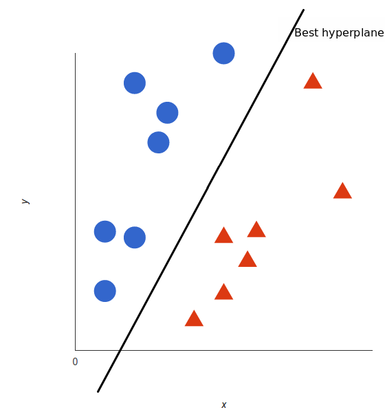

# Support Vector Machines

## What is a Support Vector Machine?

A Support Vector Machine (SVM) can be used for both classification and regression problems.  SVM uses a technique called the kernel trick which transforms the data. The SVM then finds the optimum boundary between the possible outcome, a hyperplane. Simply, it transform complicated data and then figures out how best to separate the data.
The hyperplane or split in the data can be non-linear depending on the data. 

## Example 

Imagine we have this data set, we have plotted the data over two variable x and y.

We want to split out data by circles and triangles:

 

Using SNM we can draw a line that best separates the data

 

This would be the best hyperplane in this example. This is the best hyperplane as the distance to the nearest shapes is the largest.

Both of the these lines adequately split the data. The darker line is better because it has a larger margin between the nearest shapes from each type.

 

 

## Advantages and Disadvantages of SVM

SVM has it advantages over other models as it can perform complicated transformations of the data and therefore make it easier to split the data. One of the biggest drawbacks of this is that it then makes it harder to interpret the results of the 

## Real use examples

* Face detection — SVM classify parts of the image as a face and non-face and create a square boundary around the face.
* Bioinformatics — SVM  can be used for identifying the classification of genes
* Classification of images —  SVMs provides better search accuracy for image classification than other types of model. 
